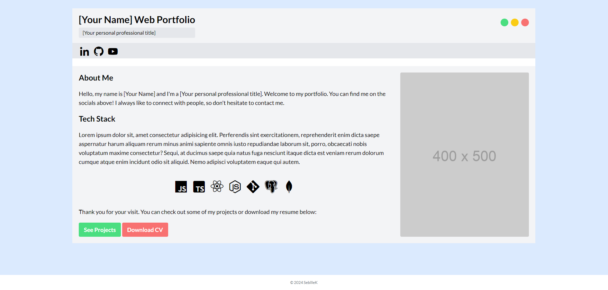
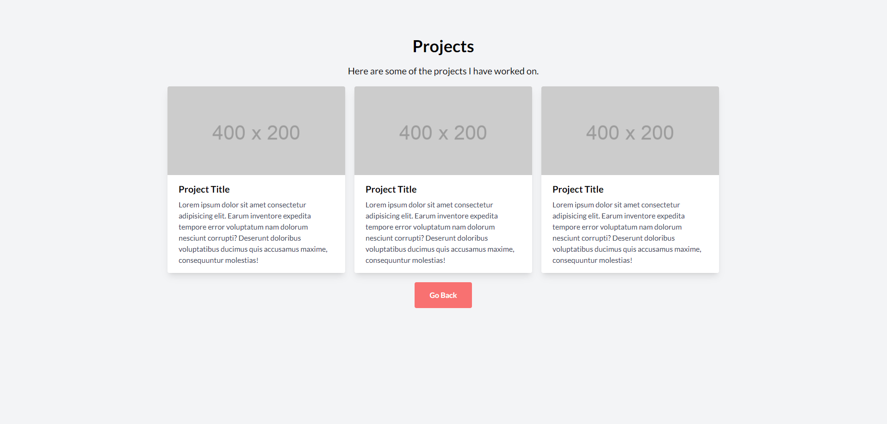

## HTML/CSS Portfolio Template — Browser Tab

Simple website HTML5/CSS3 template based on a browser window look.
Functional on mobile, albeit not optimized.

### Resources & References:

Tailwind Installation Docs
https://tailwindcss.com/docs/installation

Live Server VSCode Extension
https://marketplace.visualstudio.com/items?itemName=ritwickdey.LiveServer

Lato Font on Google Fonts
https://fonts.google.com/specimen/Lato

Placeholder Image Generator
https://via.placeholder.com/

Icons
https://boxicons.com/

Sample CV (cv-template.pdf)
https://www.sbs.ox.ac.uk/sites/default/files/2019-01/cv-template.pdf
